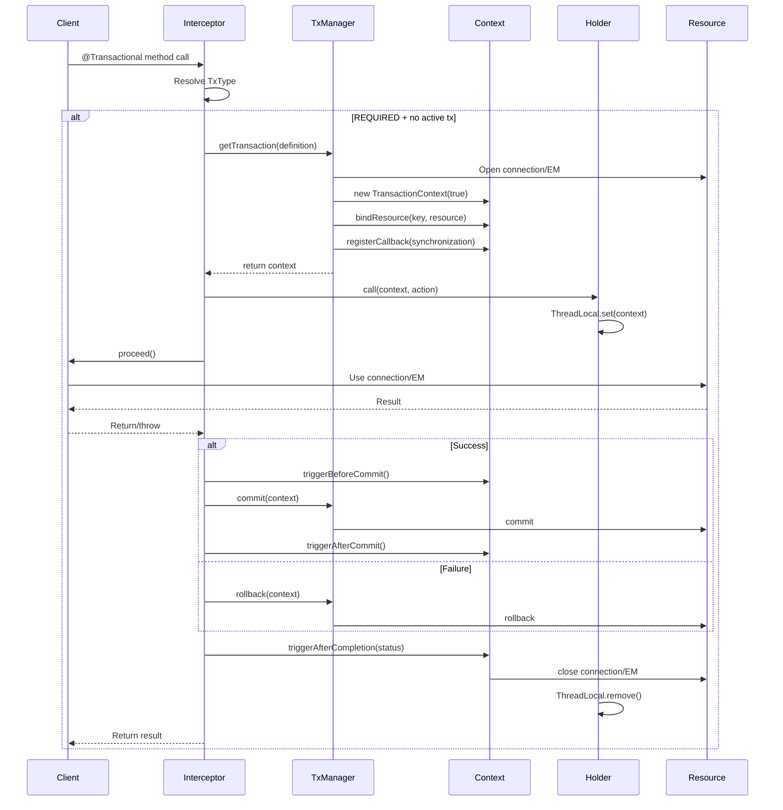

# Transaction Manager Architecture Review

**Audience:** Engineering team  
**Purpose:** Review the current transaction manager design after API simplification  
**Date:** 2026-09-30

---

## Executive Summary

The `fluda-tx` module provides container-agnostic, resource-local transaction management for Jakarta EE environments. The design follows a **Strategy pattern** with a clear separation between:

1. **Transaction lifecycle management** (PlatformTransactionManager SPI)
2. **Thread-scoped context binding** (TransactionContextHolder)
3. **Per-transaction state** (TransactionContext)
4. **Declarative transaction boundaries** (CDI interceptor)

The recent refactoring simplified the API by removing the `TransactionSynchronizationManager` facade layer, applying the Single Responsibility Principle: `TransactionContext` now manages its own resources and callbacks directly.

---

## Component Architecture

```mermaid
graph TB
    subgraph "Application Layer"
        A[@Transactional Bean]
    end
    
    subgraph "CDI Layer"
        B[TransactionalInterceptor]
        C[TransactionalCdiExtension]
    end
    
    subgraph "Core SPI"
        D[PlatformTransactionManager]
        E[TransactionContext]
        F[TransactionContextHolder]
        G[TransactionCallback]
    end
    
    subgraph "Implementations"
        H[DataSourceTransactionManager<br/>JDBC]
        I[JpaTransactionManager<br/>JPA]
        J[TransactionAwareDataSourceProxy]
    end
    
    A -->|intercepted by| B
    B -->|uses| D
    B -->|binds context| F
    F -->|holds| E
    D -->|creates| E
    E -->|registers| G
    
    D -.->|implemented by| H
    D -.->|implemented by| I
    H -->|binds Connection| E
    I -->|binds EM + Connection| E
    J -->|looks up Connection| E
    
    style D fill:#e1f5ff
    style E fill:#fff4e1
    style F fill:#f0f0f0
```

### Component Responsibilities

| Component | Responsibility | Scope |
|-----------|---------------|-------|
| **PlatformTransactionManager** | Strategy SPI: begin/commit/rollback transactions | Interface |
| **TransactionContext** | Per-transaction state: resources, callbacks, flags | Instance (per tx) |
| **TransactionContextHolder** | Thread-local binding of TransactionContext | Static (ThreadLocal) |
| **TransactionCallback** | Lifecycle callbacks (beforeCommit, afterCompletion, etc.) | Interface |
| **TransactionalInterceptor** | CDI interceptor driving transaction lifecycle | CDI bean |
| **DataSourceTransactionManager** | JDBC implementation | Concrete class |
| **JpaTransactionManager** | JPA implementation with JDBC fallback | Concrete class |
| **TransactionAwareDataSourceProxy** | Returns transaction-bound Connection | Proxy |

---

## Transaction Lifecycle Flow



### Key Flow Points

1. **Interceptor resolves propagation** — determines whether to create a new transaction or join existing
2. **TransactionManager creates context** — opens resource, binds to context, registers cleanup callback
3. **ContextHolder binds context** — makes it available via ThreadLocal for the duration of the action
4. **Business code executes** — can access bound resources via `TransactionContextHolder.get()`
5. **Completion phase** — triggers callbacks, commits/rollbacks, releases resources
6. **Context unbound** — ThreadLocal cleared, nested transactions restored

---

## Resource Binding Strategy

### JDBC (DataSourceTransactionManager)

```java
TransactionContext context = new TransactionContext(true);
context.bindResource(dataSource, connection);  // Key: DataSource instance
context.registerCallback(new ConnectionSynchronization(connection));
```

**Lookup:**
```java
Connection conn = (Connection) ctx.getResource(dataSource);
```

### JPA (JpaTransactionManager)

```java
TransactionContext context = new TransactionContext(true);
context.bindResource(entityManagerFactory, entityManager);  // Key: EMF instance
context.bindResource(dataSource, connection);                // JDBC fallback
context.registerCallback(new EntityManagerSynchronization(em));
```

**Lookup:**
```java
// By key (requires raw EMF, not CDI proxy)
EntityManager em = (EntityManager) ctx.getResource(entityManagerFactory);

// By type (CDI proxy-safe)
EntityManager em = ctx.findResourceByType(EntityManager.class);
```

### Dual Binding (JPA)

The JPA manager binds **both** the EntityManager and the underlying JDBC Connection:
- **EntityManager** under `EntityManagerFactory` key — for JPA operations
- **Connection** under `DataSource` key — for JDBC fallback via `TransactionAwareDataSourceProxy`

This allows mixing JPA and plain JDBC in the same transaction, both operating on the same physical connection.

---

## Design Decisions

### 1. Strategy Pattern for TransactionManager

**Decision:** `PlatformTransactionManager` is a strategy interface, not a concrete class.

**Rationale:**
- Different resource types (JDBC, JPA, JMS) need different transaction management
- Allows provider-agnostic implementations (no Hibernate/EclipseLink dependency)
- Follows Spring's `PlatformTransactionManager` pattern

**Trade-off:**
- Requires explicit configuration (no auto-detection)
- More boilerplate than container-managed transactions

### 2. Direct Context Access (No Facade)

**Decision:** Removed `TransactionSynchronizationManager` facade. Calling code uses `TransactionContextHolder.get()` directly.

**Rationale:**
- **Single Responsibility:** `TransactionContext` manages its own state
- **Simpler API:** One less layer of indirection
- **Clearer ownership:** Context holds resources, not a separate manager

**Trade-off:**
- Callers must null-check `TransactionContextHolder.get()`
- Less "magical" than Spring's static facade

### 3. IdentityHashMap for Resources

**Decision:** Resources are stored in an `IdentityHashMap` keyed by owner instance.

**Rationale:**
- Multiple DataSources/EntityManagerFactories can coexist
- Identity-based lookup prevents accidental collisions
- Matches Spring's approach

**Trade-off:**
- CDI proxies break identity (proxy != raw instance)
- Requires `findResourceByType()` fallback for CDI scenarios

### 4. Callback-Based Cleanup

**Decision:** Resources register `TransactionCallback` instances for lifecycle management.

**Rationale:**
- Decouples resource cleanup from transaction manager
- Allows custom cleanup logic (e.g., reset auto-commit, close EM)
- Follows Spring's `TransactionSynchronization` pattern

**Trade-off:**
- Callbacks must be registered explicitly
- No automatic resource tracking

### 5. Provider-Agnostic JPA

**Decision:** `JpaTransactionManager` uses only `jakarta.persistence` API, with optional `ConnectionExtractor` for provider-specific connection extraction.

**Rationale:**
- No compile-time dependency on Hibernate/EclipseLink
- Works with any JPA provider
- `ConnectionExtractor.DEFAULT` provides Hibernate 7 fallback via reflection

**Trade-off:**
- Reflection-based fallback is fragile (may break on Hibernate updates)
- Custom extractors needed for non-Hibernate providers

---

## Strengths

✅ **Clean separation of concerns** — SPI, context, holder, and callbacks have distinct responsibilities

✅ **Provider-agnostic** — No hard dependencies on Hibernate, EclipseLink, or specific JDBC pools

✅ **CDI integration** — Transparent `@Transactional` support with full propagation semantics

✅ **Mixed JPA + JDBC** — Dual binding allows both in the same transaction

✅ **Testable** — Core SPI can be tested without CDI container

✅ **Multi-release JAR** — Java 21 base + Java 25 ScopedValue for structured concurrency

---

## Potential Concerns

### 1. CDI Proxy Identity Issue

**Problem:** CDI injects client proxies for `@ApplicationScoped` beans. `IdentityHashMap` uses `==` (identity), so proxy != raw instance.

**Why ConcurrentHashMap doesn't help:** CDI proxies don't delegate `equals()` — they use the default `Object.equals()` which is identity-based. So even with `ConcurrentHashMap`, `proxyEmf.equals(rawEmf)` returns `false`.

**Current workaround:** `findResourceByType()` searches by value instead of key.

**Risk:**
- Only works for single-EMF scenarios
- Multi-EMF applications need raw instance references
- Silent wrong-resource bug if multiple resources of same type exist

**Mitigation:**
- Use `currentEntityManager()` (no-arg) for single-EMF CDI scenarios
- Use `currentEntityManager(rawEmf)` with raw instance for multi-EMF
- Document that CDI proxy injection for EntityManagerFactory is not recommended in multi-EMF scenarios
- Future enhancement: Add validation to detect multiple resources and fail fast

**Why we can't unwrap CDI proxies:** There's no standard CDI API to unwrap a proxy to its underlying instance. CDI proxies are designed to be transparent, and the underlying instance is not accessible through the proxy interface.

### 2. No Transaction Propagation Across Threads

**Problem:** `InheritableThreadLocal` propagates to child threads, but not across async boundaries (CompletableFuture, virtual threads).

**Current state:** Java 25 multi-release JAR uses `ScopedValue` for structured concurrency.

**Risk:**
- Traditional async (CompletableFuture) loses transaction context
- Users must explicitly propagate context

**Mitigation:** Document limitations; consider `TransmittableThreadLocal` for broader compatibility.

### 3. No Nested Transaction Support (REQUIRES_NEW)

**Problem:** `REQUIRES_NEW` creates a new context, but the outer transaction is suspended, not committed.

**Current state:** Interceptor shadows outer context via `TransactionContextHolder.call()`.

**Risk:**
- True nested transactions (savepoints) not supported
- Resource locks held across suspension

**Mitigation:** Document that `REQUIRES_NEW` is "suspend and start new", not true nesting.

### 4. Manual Resource Binding

**Problem:** Transaction managers must manually bind resources and register callbacks.

**Current state:** Each implementation (JDBC, JPA) handles this in `getTransaction()`.

**Risk:**
- Easy to forget cleanup callback
- No compile-time safety

**Mitigation:** Provide base class or builder for custom transaction managers.

### 5. No XA/JTA Support

**Problem:** Resource-local only — no distributed transactions across multiple resources.

**Current state:** Explicitly out of scope (use Jakarta EE server for JTA).

**Risk:**
- Cannot coordinate multiple DataSources or JMS
- No two-phase commit

**Mitigation:** Document scope; recommend Narayana or Bitronix for JTA needs.

---

## API Usage Patterns

### Pattern 1: Declarative (Recommended)

```java
@ApplicationScoped
public class UserService {
    @Inject
    private EntityManager em;
    
    @Transactional
    public void createUser(User user) {
        em.persist(user);  // Uses transaction-bound EM
    }
}
```

### Pattern 2: Programmatic Access to Resources

```java
@Transactional
public void mixedOperation() {
    // JPA
    EntityManager em = JpaTransactionManager.currentEntityManager();
    em.persist(entity);
    
    // JDBC (same connection)
    try (Connection conn = dataSource.getConnection();
         PreparedStatement stmt = conn.prepareStatement("INSERT ...")) {
        stmt.executeUpdate();
    }
}
```

### Pattern 3: Custom Transaction Manager

```java
public class CustomTransactionManager implements PlatformTransactionManager {
    @Override
    public TransactionContext getTransaction(TransactionDefinition def) {
        TransactionContext ctx = new TransactionContext(true);
        MyResource resource = openResource();
        ctx.bindResource(resourceKey, resource);
        ctx.registerCallback(new MyCleanupCallback(resource));
        return ctx;
    }
    
    @Override
    public void commit(TransactionContext ctx) {
        MyResource resource = (MyResource) ctx.getResource(resourceKey);
        resource.commit();
    }
    
    @Override
    public void rollback(TransactionContext ctx) {
        MyResource resource = (MyResource) ctx.getResource(resourceKey);
        resource.rollback();
    }
}
```

---

## Comparison with Spring

| Aspect | Spring | FluDa |
|--------|--------|-------|
| **Facade** | `TransactionSynchronizationManager` (static) | `TransactionContextHolder.get()` (direct) |
| **Resource storage** | `TransactionSynchronizationManager` resources | `TransactionContext` resources |
| **Callbacks** | `TransactionSynchronization` | `TransactionCallback` |
| **JPA support** | `JpaTransactionManager` + `JpaDialect` | `JpaTransactionManager` + `ConnectionExtractor` |
| **Provider binding** | Provider-specific dialects | Provider-agnostic (reflection fallback) |
| **CDI support** | Spring AOP | CDI interceptor |
| **JTA support** | `JtaTransactionManager` | Out of scope |

**Key difference:** FluDa removes the static facade layer, making the API more explicit but less "magical".

---

## Recommendations

### Short-term

1. **Document CDI proxy limitation** — Add Javadoc warning about identity issues
2. **Add base class** — Provide `AbstractPlatformTransactionManager` for custom implementations
3. **Improve error messages** — Include resource keys in "not bound" exceptions

### Medium-term

1. **Consider `TransmittableThreadLocal`** — For better async compatibility
2. **Add savepoint support** — For true nested transactions
3. **Provide Micrometer integration** — Transaction metrics

### Long-term

1. **GraalVM native support** — Verify reflection-based fallback works in native image
2. **Reactive transaction support** — For Quarkus/Vert.x integration
3. **Kotlin coroutines support** — Context propagation for coroutines

---

## Conclusion

The current design is **clean, focused, and provider-agnostic**. The recent refactoring improved API clarity by removing the facade layer and applying single responsibility.

**Best suited for:**
- Jakarta EE applications needing resource-local transactions
- Mixed JPA + JDBC scenarios
- Container-agnostic libraries

**Not suited for:**
- Distributed transactions (use JTA)
- Reactive/async-heavy workloads (context propagation issues)
- Multi-EMF scenarios with CDI proxies (identity issues)

The architecture is **solid for its scope** and provides a good foundation for future enhancements.

---

## References

- **Source code:** `D:\hantsylabs\fludakit\tx`
- **Spring comparison:** Spring Framework `TransactionSynchronizationManager`
- **Jakarta specs:** JTA 2.0, CDI 4.1, JPA 3.2
- **Related ADRs:** None yet (consider creating one for this design)
